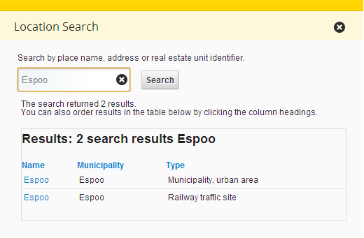

# search

Provides a generic and extensible search user-interface

## Description

Provides (address etc) search functionality with a flyout UI.

## Screenshot



## Bundle configuration

No configuration is required, but it can be used to set ajax URL. If not set, `sandbox.getAjaxUrl()` with `action_route=GetSearchResult` is used instead.

The default search UI can be disable through config.

```javascript
{
  "url" : "http://www.google.com",
  "disableDefault": "<boolean>"
}
```

## Requests the bundle sends out

<table class="table">
  <tr>
    <th>Request</th><th>How does the bundle react</th>
  </tr>
  <tr>
    <td>MapMoveRequest</td><td>When a search result is clicked, the map is centered on the location.</td>
  </tr>
  <tr>
    <td> InfoBox.ShowInfoBoxRequest </td><td> When a search result is clicked, information about the results is shown on an Infobox</td>
  </tr>
  <tr>
    <td> InfoBox.HideInfoBoxRequest </td><td> Hides search result infobox.</td>
  </tr>
  <tr>
    <td> MapModulePlugin.RemoveMarkerRequest </td><td> When the search keyword is removed, any markers on the map are removed.</td>
  </tr>
</table>

## Dependencies

<table class="table">
  <tr>
    <th> Dependency </th><th> Linked from </th><th> Purpose</th>
  </tr>
  <tr>
    <td> [jQuery](http://api.jquery.com/) </td>
    <td> Linked in portal theme </td>
    <td> Used to create the component UI from begin to end</td>
  </tr>
  <tr>
    <td> [OpenLayers](http://openlayers.org/) </td>
    <td> Expects mapmodule to be present and OpenLayers already linked </td>
    <td> To control map and show an Openlayers popup on it</td>
  </tr>
  <tr>
    <td> [Oskari divmanazer](/documentation/bundles/framework/divmanazer) </td>
    <td> DivManazerBundle </td>
    <td> Provides flyout/tile functionality</td>
  </tr>
  <tr>
    <td> [Backend API](/documentation/backend/search) </td>
    <td> N/A </td>
    <td> Search is handled in backend</td>
  </tr>
</table>